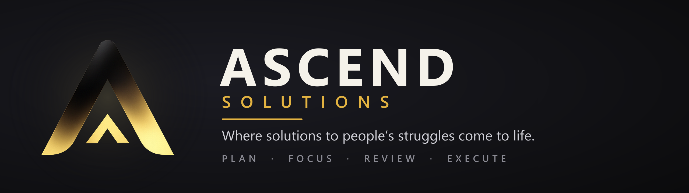
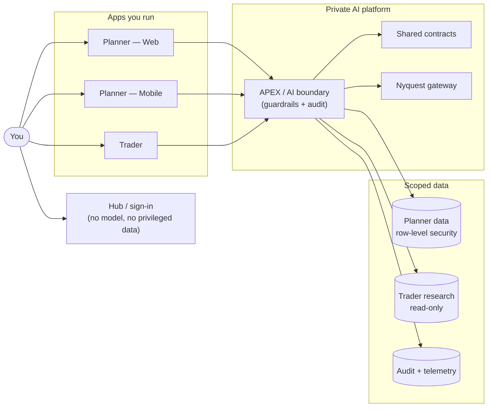
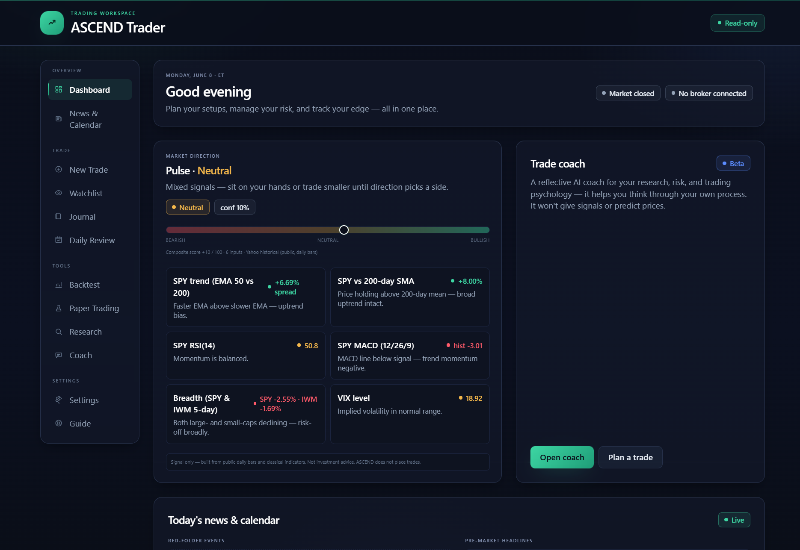
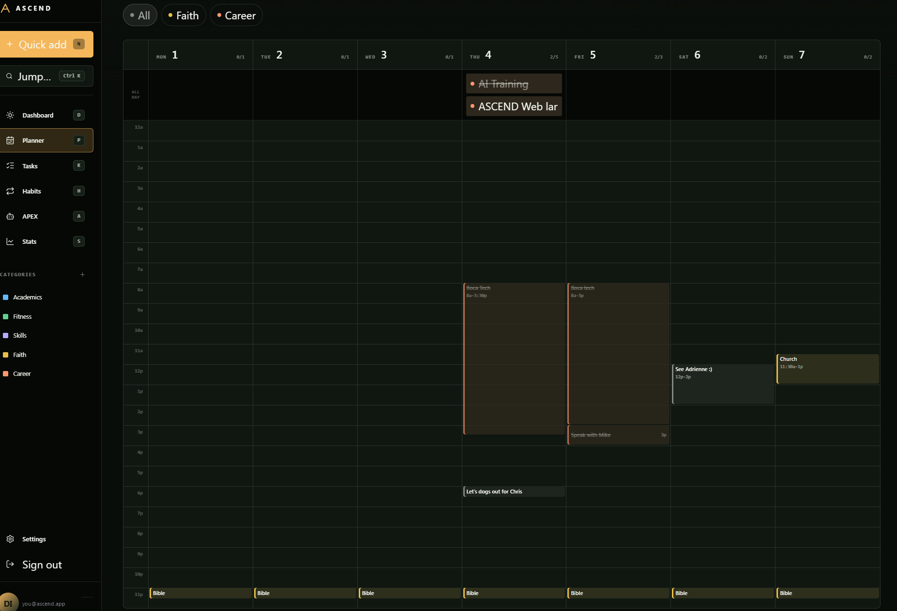
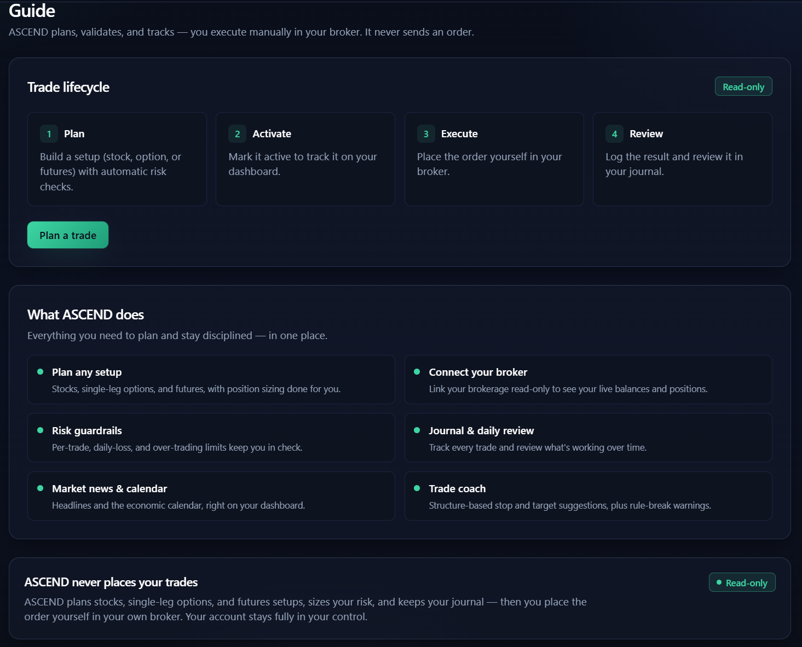

  

  
  
  
  
  

<h1 align="center">ASCEND Solutions</h1>

  <b><i>Where solutions to people's struggles come to life.</i></b> 
  A premium, security-first ecosystem for disciplined execution — plan your days, build focus, and
  research markets, with an AI layer built to be trusted, not hyped.

  🌐 <a href="https://ascenddaily.app"><b>ascenddaily.app</b></a>

---

> [!NOTE]
> **This is a showcase repository.** It contains documentation, architecture write-ups, brand
> guidance, and the engineering lessons I've collected building ASCEND Solutions. **There is no
> application source code here** — by design. It's the public window into the work, not the work
> itself.

## What is ASCEND Solutions?

**ASCEND Solutions** exists to turn real struggles into tools people can actually use. It's a
multi-product ecosystem I'm building around three ideas: **disciplined execution, premium design,
and AI you can actually trust.** One coherent platform with distinct surfaces — a planner for your
days, a trading-research workbench, and a shared intelligence layer called **APEX** that ties them
together.

Every product starts from a real struggle — staying consistent, keeping focus, making a clearer
decision — and turns it into something you can actually use. The throughline is restraint: ASCEND
is deliberately honest about what it does and doesn't do. It suggests, it never guarantees; it
researches, it never auto-trades; it assists, it never invents your data. That posture is the
product.

## The products

| Product | What it does | Status |
| --- | --- | --- |
| **ASCEND Planner — Web** | Desktop/tablet planner: tasks, habits, schedule, streaks, focus sessions, and APEX planning support. | 🟢 **Live** — free in early access |
| **ASCEND Planner — Mobile** | The same planner, native on iOS & Android (Expo / React Native). | 🟡 **In development** — no store links until published |
| **ASCEND Trader** | A safety-first workbench to research setups, validate risk, backtest, journal, and coach — it never places trades. | 🔵 **Live — research only** |
| **APEX** | The shared AI intelligence layer — planning help, structured analysis, and coaching. | 🟢 **Live — early access** |

> [!IMPORTANT]
> **ASCEND Trader plans, validates, and journals — it does not place trades.** Order placement is
> blocked at the server. There is no live, paper-order, margin, crypto, options, or short execution; any
> execution happens manually in your own broker. **ASCEND Trader is not financial advice.**

See **[docs/products.md](docs/products.md)** for the full tour.

## What makes it different

- **🔒 Security-first architecture.** The apps you run never hold privileged keys. All AI work
  happens behind a private platform boundary, and data access is scoped at the database layer.
  [How →](docs/security-and-safety.md)
- **🤖 AI built to be trusted.** APEX is **live in early access** — and the constraints held when it
  went live. It prefers deterministic product logic before it ever calls a model, states its
  assumptions, and never invents records, balances, or trades. Guardrails and kill-switches were
  designed in from day one, not bolted on.
- **🛡️ Trading safety as a hard constraint.** Paper/simulation by default, order placement blocked
  server-side, and a written checklist that any future live path must clear first.
- **🎚️ Honest marketing.** The public site advertises only what's real today. No vaporware, no
  "subscribe now" buttons that don't charge, no store links for unpublished apps.
- **🎨 A disciplined design language.** Black, charcoal, and gold. Calm, specific copy. Premium
  without the noise. [Design system →](docs/design-system.md)

## Architecture at a glance

ASCEND apps talk to a private AI platform — they never call model providers directly, and they
never hold model or service-role credentials. Shared contracts keep every surface in agreement.

> This diagram is intentionally high-level. The implementation lives in a private monorepo.
> Full conceptual write-up + deployment, identity, and request-lifecycle diagrams:
> **[docs/architecture.md](docs/architecture.md)**.

## Screenshots

  

<b>ASCEND Trader</b> — market pulse, your edge, and the trade coach in one place.

  
  

<b>Left:</b> the Planner week grid. <b>Right:</b> Trader's safety model — you execute manually; ASCEND never sends an order.

More — Trader news, the economic calendar, watchlist, and read-only broker connect — in the full
visual tour: **[docs/gallery.md](docs/gallery.md)**.

## What's new

APEX went live, Trader became a full research workbench, and the whole thing consolidated into one
monorepo. The honest, grouped log is in **[docs/changelog.md](docs/changelog.md)**; the forward-looking
status board is in **[docs/roadmap.md](docs/roadmap.md)**.

## Tech stack

`TypeScript (strict)` · `Next.js (App Router) + React` · `Expo / React Native` · `Tailwind CSS`
· `Supabase (Auth, Postgres, RLS)` · `Zod contracts` · `pnpm workspaces + Turborepo` · a private
AI platform on `Cloudflare Workers` reaching models via the `Nyquest` gateway · hybrid deploy across
`Vercel` and `Cloudflare`. See **[docs/tech-stack.md](docs/tech-stack.md)** for the full map.

## What I've been learning

The most valuable output of this project isn't any one feature — it's everything building it has
taught me about architecture, security, AI safety, and shipping with discipline. I keep that as a
running engineering journal:

➡️ **[LEARNINGS.md](LEARNINGS.md)** — the lessons, the mistakes, and the decisions behind them.

## Documentation map

| Doc | What's inside |
| --- | --- |
| [docs/overview.md](docs/overview.md) | The vision, the problem, and the shape of the ecosystem |
| [docs/products.md](docs/products.md) | Every product, what it owns, and its honest status |
| [docs/architecture.md](docs/architecture.md) | The conceptual architecture + diagrams (Mermaid) |
| [docs/tech-stack.md](docs/tech-stack.md) | The stack and the monorepo workspace map |
| [docs/security-and-safety.md](docs/security-and-safety.md) | Security model + trading-safety posture |
| [docs/design-system.md](docs/design-system.md) | Brand, color, type, and voice |
| [docs/changelog.md](docs/changelog.md) | **What's been updated** — the milestone log |
| [docs/roadmap.md](docs/roadmap.md) | **Status board** — done, in progress, next, gated |
| [docs/gallery.md](docs/gallery.md) | Product screenshots |
| [LEARNINGS.md](LEARNINGS.md) | The engineering journal |

## About & connect

**ASCEND Solutions** is designed and built by **Diego** — an ongoing, solo-led project, built
deliberately, shipped honestly, and documented in the open here. *Where solutions to people's
struggles come to life.*

  
  
  

- 🌐 **Live:** [ascenddaily.app](https://ascenddaily.app)
- 📸 **Instagram:** [@ascend1211](https://instagram.com/ascend1211)
- 💻 **This repo:** [github.com/bjjlops/ASCEND-Showcase](https://github.com/bjjlops/ASCEND-Showcase)
- 📄 **License:** [LICENSE](LICENSE) — docs and brand only; no code is licensed here.

---

  <b>ASCEND Solutions</b> · Plan · Focus · Review · Execute · <a href="https://instagram.com/ascend1211">@ascend1211</a>

