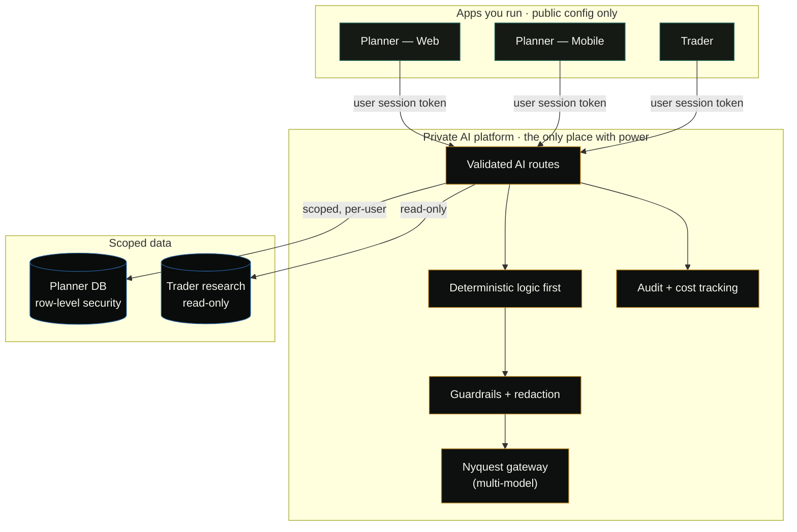
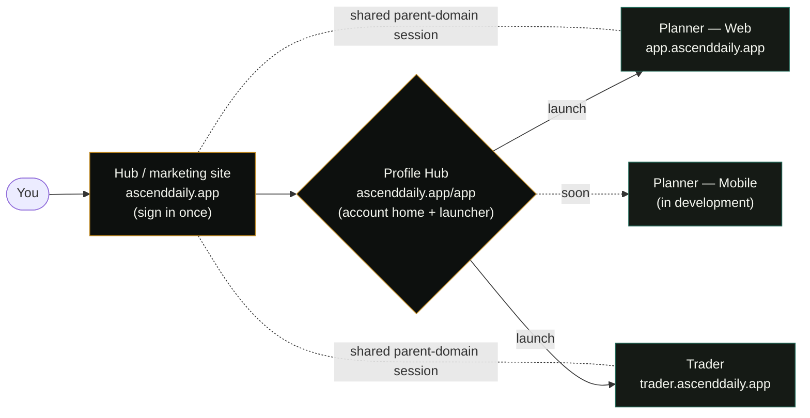
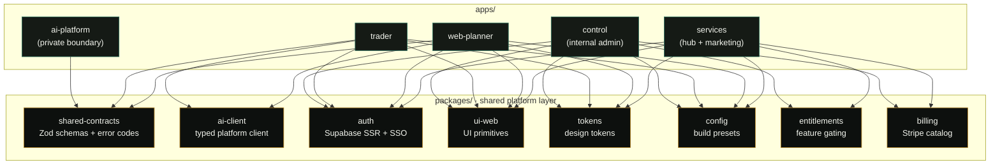
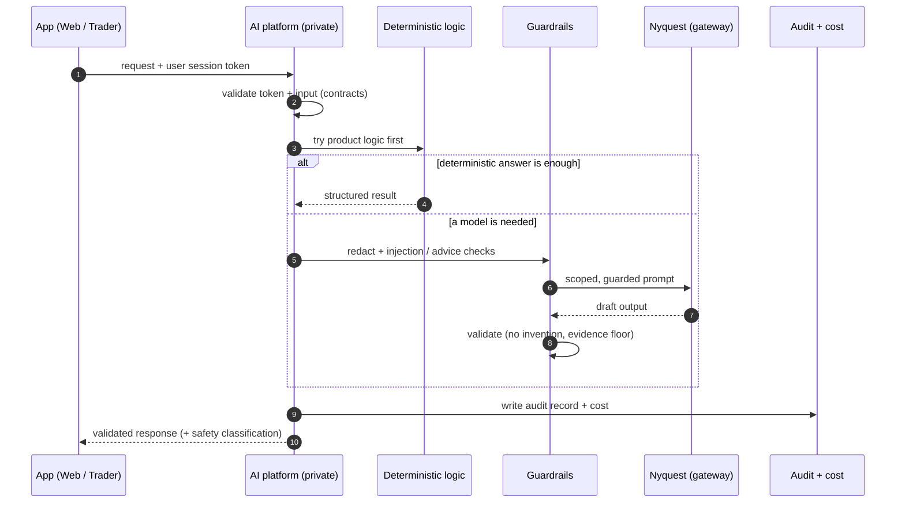
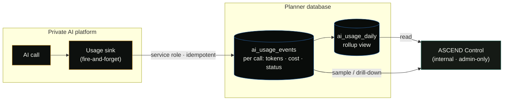
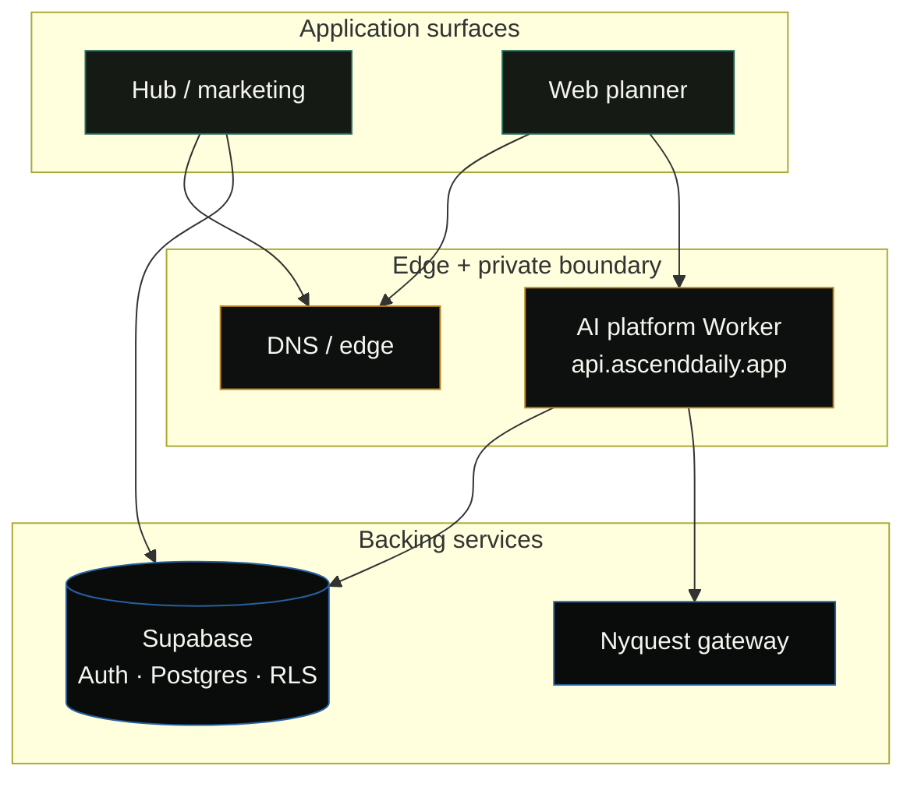

# Architecture (conceptual)

> A high-level, conceptual description of how ASCEND Solutions is put together. It's intentionally
> light on internals — there's no source code, no API contract, and no infrastructure secret here.
> The point is to show *how the system thinks*, not how to rebuild it. All diagrams below render
> natively on GitHub (Mermaid).

## The core principle: a private AI boundary

The single most important architectural decision in ASCEND is that **the apps you run are not
trusted with privileged power.**

- The apps (Web Planner, Mobile Planner, Trader) hold only public, browser-safe configuration.
- They **never** hold model-provider keys, and they **never** hold privileged database credentials.
- All AI work happens behind a **private platform boundary**. The apps ask the platform for
  intelligence; they don't reach for models themselves.

This keeps the blast radius of any one app small. A leaked client build leaks nothing that matters.

**APEX is live now** — these routes run against real models in production — but the boundary is the
reason that's safe: models are reached only through **Nyquest**, one private multi-model gateway, behind guardrails, with the
keys living server-side and nowhere else. As of the per-solution billing ship, these paid AI routes
are also **entitlement-checked** — they are *not* open to every signed-in user. The same boundary
that guards the keys is now the **entitlement backstop** too: an AI request only clears it if the
caller holds the subscription that unlocks it. Gating and safety live at one wall, not two.

## Hub-and-spoke identity

The marketing site doubles as the **identity hub**. You sign in once at the front door, and the
**Profile Hub** at `ascenddaily.app/app` routes you into whichever product you want. A shared
**parent-domain session** (one cookie across subdomains) makes the ecosystem feel like a single
product, even though each surface is an independent app.

> This supersedes the earlier "**/app launcher**" note — the *what* changed (the bare "pick an app"
> launcher is now the **Profile Hub**, a real account home), the *how* didn't (it still launches the
> solutions on the same shared parent-domain session; routing is preserved).

The Profile Hub is now the **single self-serve place** a customer manages everything — it still
launches the solutions, but it is also where you subscribe, unsubscribe, fix a failed card, and edit
your profile, and it's where every "upgrade" prompt across the platform points. Four sections:

- **Your account** — name (editable right there, synced with **Planner** settings), email, sign out.
- **Your solutions** — one card per product (the **Planner**, the **Trader**), each showing a
  **status badge** (Free / Pro / Lifetime / Payment issue), the AI benefits that solution unlocks,
  an **Open** button, and buy/manage buttons.
- **Billing summary** — total per month, next renewal date, and a **Manage payment & invoices**
  button that opens the **Stripe** secure customer portal (update card, view invoices, cancel).
- **Account** — change your password without leaving the page.

Here "Pro" no longer names a single product — it just means *this solution's paid tier is active*.

## Built as a monorepo

The apps and shared packages live together in a single **pnpm workspaces + Turborepo** monorepo.
Shared packages are consumed as workspace packages — no fragile cross-repo linking, no token-gated
private installs in CI. Turborepo runs builds in dependency order and caches aggressively.

## Billing, entitlements, and the webhook as sole grant

Two shared packages — **`billing`** (the Stripe catalog) and **`entitlements`** (feature gating) —
carry the business model. Both the **Profile Hub** and **Control** depend on them, so the front door
and the operator's console reason about paid access from the *same* definitions.

### Per-solution, additive billing

Billing is **per-solution and additive**, not one flat plan. Each solution — the **Planner**, the
**Trader** — is **$5/month**, and they stack onto **one subscription and one invoice**: the Planner
alone is **$5/mo**; add the Trader and you're at **$10/mo**, still one subscription, one invoice.
Each solution also has a **$199 lifetime** option — pay once for that solution, never again.

The mechanics are designed so nobody is ever surprised or double-charged:

- **Add your first solution** → it goes through **Stripe Checkout**.
- **Add another** → charged **instantly to the card on file, prorated, with no checkout** — you're
  already a known customer.
- **Remove a solution** → **immediate removal with prorated credit** for unused time. Removing your
  *last* solution **cancels the subscription**.
- **Buy lifetime while on monthly** → the system **automatically removes the now-pointless $5
  monthly item**, so you never pay twice for the same solution.

> This supersedes the earlier single "**Planner Pro — $5/mo**" framing — the *what* changed (billing
> is now per-solution and additive, with a lifetime option per solution), the *how* didn't (access
> is still granted by webhook truth alone, never by a client claim).

### The webhook is the only thing that can grant access

**Stripe** reports every payment event to the server, and **that webhook pathway is the only thing
that can grant access** — never a client claim, never a return URL. There are no fake "payment
success" states: the browser can *ask*, but only the webhook can *unlock*. Entitlements are
webhook-truth, full stop.

That single grant path is hardened against the edge cases that actually bite billing systems:

- **Retries / duplicate delivery** — the handler is **idempotent**, so at-least-once delivery can't
  double-apply.
- **Duplicate subscriptions** created from two browser tabs racing checkout.
- **A later monthly event overwriting a lifetime purchase** — lifetime wins.
- **Price-ID changes** accidentally revoking paying customers.

So `billing` decides *what was purchased*, the webhook is the *only* way that fact lands, and
`entitlements` turns the landed fact into *what unlocks* — grant on payment, revoke on cancel.

### AI gating: three fail-closed layers

A solution's AI benefits require **that solution's subscription** — no subscription, no AI. This is a
tightening of discipline, not a downgrade of the honesty posture: it's **fail-closed** gating, so the
system's default is to *withhold* AI until access is proven, and it errs toward refusing rather than
leaking. The paid/free split, at conceptual altitude:

- **Planner AI — paid** (needs the Planner sub): APEX chat, dashboard AI insights, day analysis,
  weekly summary. **Still free:** tasks, habits, planner, reviews, stats.
- **Trader AI — paid** (needs the Trader sub): AI coach chat, research summaries, "paste & extract,"
  AI risk review. **Still free:** manual research, journaling, the rule-based daily review.

Enforcement lives at **three layers**, so a bug at one can't open the door:

1. **App pages** — the clean in-app UI prompt ("this is part of Pro — **$5/month**," linking to the
   Profile Hub). Free users see a tidy upsell, **never a broken screen or a raw error**.
2. **App server routes** — the real block, so the UI can't be bypassed by calling the route directly.
3. **The central AI platform** — the backstop every AI request must pass through. Even a bug in an
   app can't leak free AI, because the request still has to clear the boundary.

That third layer is exactly the **private AI boundary / Nyquest gateway** from the top of this doc:
the wall that already held the keys and the guardrails is now *also* the entitlement backstop — one
place to trust, not three.

**Cancel-grace:** cancel a subscription and its AI keeps working **until the end of the period you
already paid for**, then shuts off **within about a minute**. You keep what you paid for; you don't
keep more.

None of this loosens a safety constraint. The **Trader** still never places orders (blocked
server-side), AI still never invents your data, and apps still hold no privileged keys. Gating is a
new *entitlement* wall layered onto the same safety walls — it takes nothing away from them.

## Contract-driven surfaces

Every surface agrees on the same shapes through a shared **contracts** library — schemas, types, and
stable error codes (built on Zod). The contracts library is the dictionary the whole system speaks;
it holds *definitions*, never business logic, model clients, or database clients.

The payoff: a change to a shared shape shows up as a type error everywhere it matters, before it
ships. The apps and the platform can't quietly drift out of agreement. A single typed client
(`ai-client`) is the only way the apps talk to the platform, and it carries the user's session token
on every call — never a privileged key.

## Clear ownership boundaries

ASCEND is organized so each part owns one thing well, and is explicitly forbidden from owning others:

- **Planner** owns planning logic and planner data. It knows nothing about brokers or trading.
- **Trader** owns research, risk, and trading-safety tooling. It knows nothing about planner logic.
- **The AI platform** owns intelligence, guardrails, and audit. It owns no UI.
- **The hub / marketing site** owns presentation and identity. It owns no model and no privileged data.
- **Control** owns *observation and administration* — never product features. It reads widely (under
  strict gates), writes only audited admin actions, and calls no models.

These boundaries are written down and enforced — cross-product coupling is treated as a defect, not
a shortcut, and a CI **AI-boundary guard** fails the build if a forbidden key ever drifts toward an app.

## A request, end to end

What actually happens when you ask APEX for help — note how much can be answered *without* a model:

## Data access is scoped, not broad

- Planner data is protected with **row-level security** and per-user, scoped access — the platform
  acts on behalf of a specific signed-in user, not as a superuser.
- Trader research is exposed to the platform as **read-only**. The platform can read research; it
  cannot touch orders, broker credentials, or live account state.
- Privileged database access is reserved for a narrow, audited slice of platform-only code.

## The internal control plane

ASCEND has one more surface that users never see: **ASCEND Control**, an internal admin command
center. It's the operator's view of the platform — accounts (a 360° view), access approvals and
gating, subscriptions and revenue, **AI usage and a per-call cost ledger**, Stripe webhook
deliveries, live system health, and an **immutable audit log** of every privileged action. It is
deliberately the *most*-guarded thing in the system, because it's the one place with a wide-angle,
privileged read.

With per-solution billing live, Control's revenue math now **counts per-solution correctly** — the
Planner and the Trader are tallied as the separate line items they are — and it **excludes free
comps** (access handed out at no charge), so the revenue figure reflects real money, not gifted seats.

**Three walls guard it — defense in depth, fail-closed at each step:**

1. **Network** — it sits behind **Cloudflare Access**; you can't even reach it without passing the
   edge identity gate.
2. **Origin re-verify** — the app re-verifies that Access identity at its *own* origin (it doesn't
   trust the edge blindly) and requires a valid signed-in session.
3. **Admin allowlist** — the signed-in user must also be an **admin**, enforced by a database-level
   security-definer check over an admin-roles table. Every page checks it; every mutating action
   re-checks it.

Privilege is kept narrow and audited. The broad, RLS-bypassing service role is used **only** for
aggregate reads (usage/cost, entitlements, webhooks, health); account changes go through audited,
self-gating database functions, and **every privileged action is written to an append-only audit
log.** Control's own assistant is **deterministic** — it answers from live data and never calls a
model, so the admin tool adds no model cost and no model risk.

### The AI cost ledger, end to end

Going live on real models created a new requirement: know exactly what each call costs. The AI
platform now writes a **usage event per request** — tokens, model, status, latency, and **real cost**
— into a ledger, *fire-and-forget* so it never slows a user's response. Control reads that ledger to
show spend by model, by product, and by account.

The write is **idempotent** — one row per request id, so retries are no-ops and at-least-once
delivery can't double-count. That's what makes the "real per-call cost" number trustworthy rather
than a guess.

## Deployed as a hybrid

ASCEND runs across two clouds, each used for what it's best at — application surfaces on one
platform, edge/DNS and the private AI boundary on another. A shared session works across subdomains
so the ecosystem feels like one product even though it's many surfaces.

The details of *why* it's split this way — including a deployment approach that didn't work and what
replaced it — are in **[../LEARNINGS.md](../LEARNINGS.md)**.

## What this architecture buys

- **Containment** — apps can't leak what they never held.
- **Trust** — AI behavior is validated, guarded, redacted, and audited at one boundary.
- **Coherence** — shared contracts and enforced ownership stop drift.
- **Honesty** — safety constraints (no live trading, no privileged keys in apps) are structural,
  not promises.
