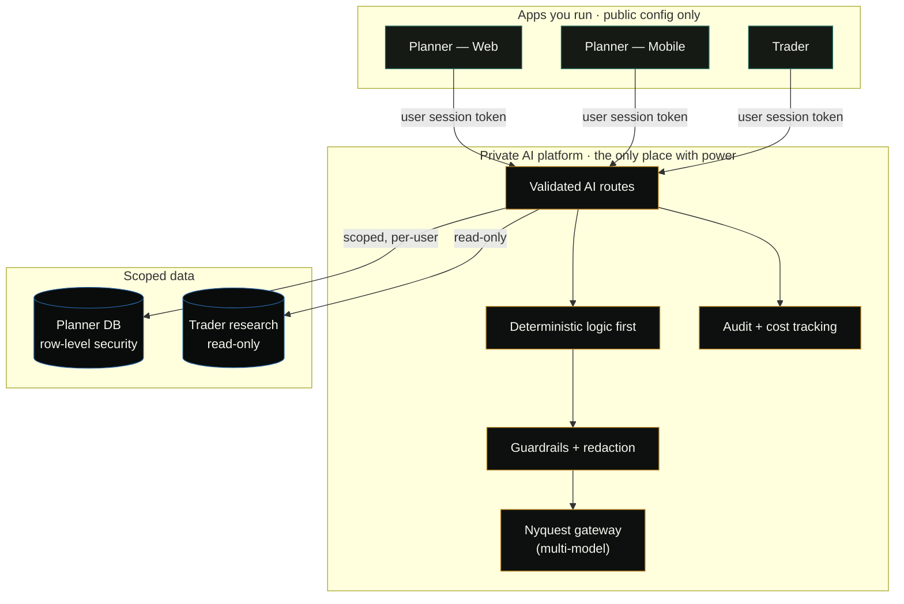
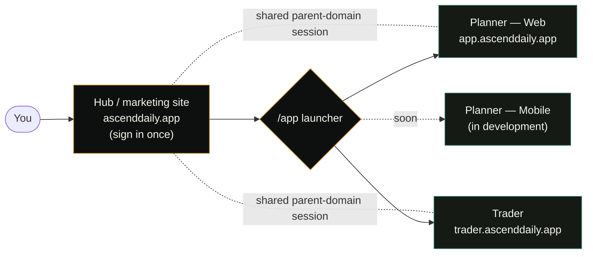
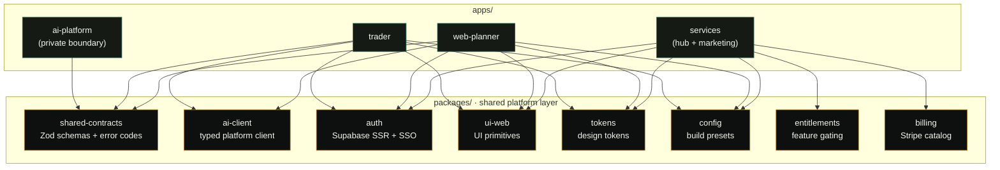
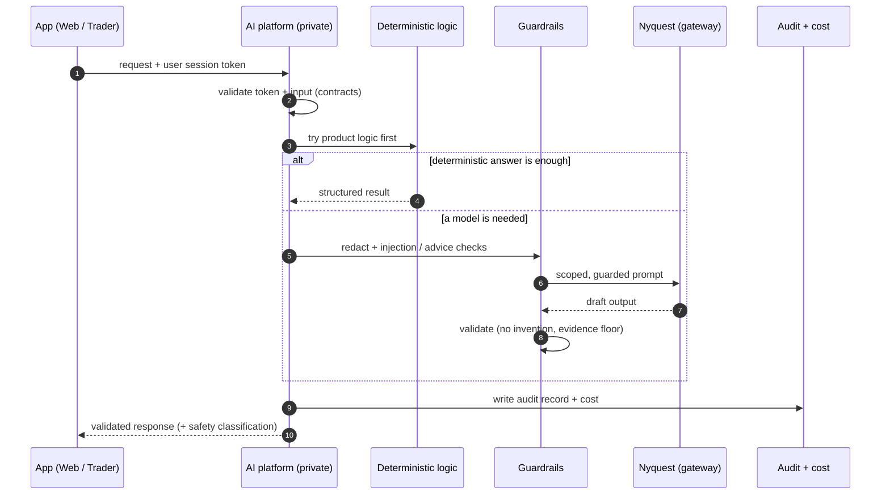
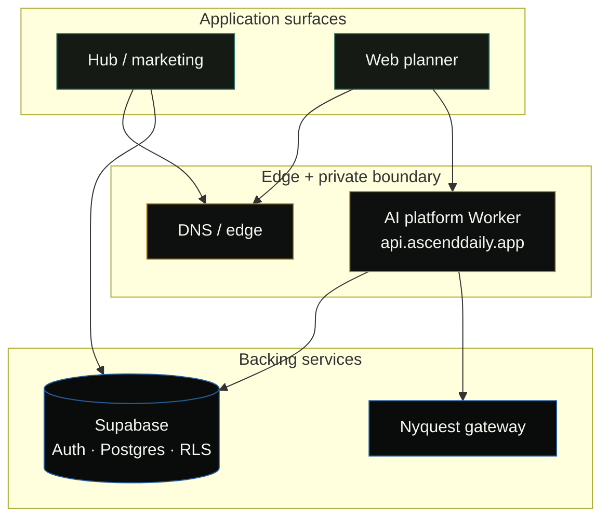

# Architecture (conceptual)

> A high-level, conceptual description of how ASCEND Solutions is put together. It's intentionally
> light on internals — there's no source code, no API contract, and no infrastructure secret here.
> The point is to show *how the system thinks*, not how to rebuild it. All diagrams below render
> natively on GitHub (Mermaid).

## The core principle: a private AI boundary

The single most important architectural decision in ASCEND is that **the apps you run are not
trusted with privileged power.**

- The apps (Web Planner, Mobile Planner, Trader) hold only public, browser-safe configuration.
- They **never** hold model-provider keys, and they **never** hold privileged database credentials.
- All AI work happens behind a **private platform boundary**. The apps ask the platform for
  intelligence; they don't reach for models themselves.

This keeps the blast radius of any one app small. A leaked client build leaks nothing that matters.

**APEX is live now** — these routes run against real models in production — but the boundary is the
reason that's safe: models are reached only through **Nyquest**, one private multi-model gateway, behind guardrails, with the
keys living server-side and nowhere else.

## Hub-and-spoke identity

The marketing site doubles as the **identity hub**. You sign in once at the front door, and an
**/app launcher** routes you into whichever product you want. A shared **parent-domain session**
(one cookie across subdomains) makes the ecosystem feel like a single product, even though each
surface is an independent app.

## Built as a monorepo

The apps and shared packages live together in a single **pnpm workspaces + Turborepo** monorepo.
Shared packages are consumed as workspace packages — no fragile cross-repo linking, no token-gated
private installs in CI. Turborepo runs builds in dependency order and caches aggressively.

## Contract-driven surfaces

Every surface agrees on the same shapes through a shared **contracts** library — schemas, types, and
stable error codes (built on Zod). The contracts library is the dictionary the whole system speaks;
it holds *definitions*, never business logic, model clients, or database clients.

The payoff: a change to a shared shape shows up as a type error everywhere it matters, before it
ships. The apps and the platform can't quietly drift out of agreement. A single typed client
(`ai-client`) is the only way the apps talk to the platform, and it carries the user's session token
on every call — never a privileged key.

## Clear ownership boundaries

ASCEND is organized so each part owns one thing well, and is explicitly forbidden from owning others:

- **Planner** owns planning logic and planner data. It knows nothing about brokers or trading.
- **Trader** owns research, risk, and trading-safety tooling. It knows nothing about planner logic.
- **The AI platform** owns intelligence, guardrails, and audit. It owns no UI.
- **The hub / marketing site** owns presentation and identity. It owns no model and no privileged data.

These boundaries are written down and enforced — cross-product coupling is treated as a defect, not
a shortcut, and a CI **AI-boundary guard** fails the build if a forbidden key ever drifts toward an app.

## A request, end to end

What actually happens when you ask APEX for help — note how much can be answered *without* a model:

## Data access is scoped, not broad

- Planner data is protected with **row-level security** and per-user, scoped access — the platform
  acts on behalf of a specific signed-in user, not as a superuser.
- Trader research is exposed to the platform as **read-only**. The platform can read research; it
  cannot touch orders, broker credentials, or live account state.
- Privileged database access is reserved for a narrow, audited slice of platform-only code.

## Deployed as a hybrid

ASCEND runs across two clouds, each used for what it's best at — application surfaces on one
platform, edge/DNS and the private AI boundary on another. A shared session works across subdomains
so the ecosystem feels like one product even though it's many surfaces.

The details of *why* it's split this way — including a deployment approach that didn't work and what
replaced it — are in **[../LEARNINGS.md](../LEARNINGS.md)**.

## What this architecture buys

- **Containment** — apps can't leak what they never held.
- **Trust** — AI behavior is validated, guarded, redacted, and audited at one boundary.
- **Coherence** — shared contracts and enforced ownership stop drift.
- **Honesty** — safety constraints (no live trading, no privileged keys in apps) are structural,
  not promises.
