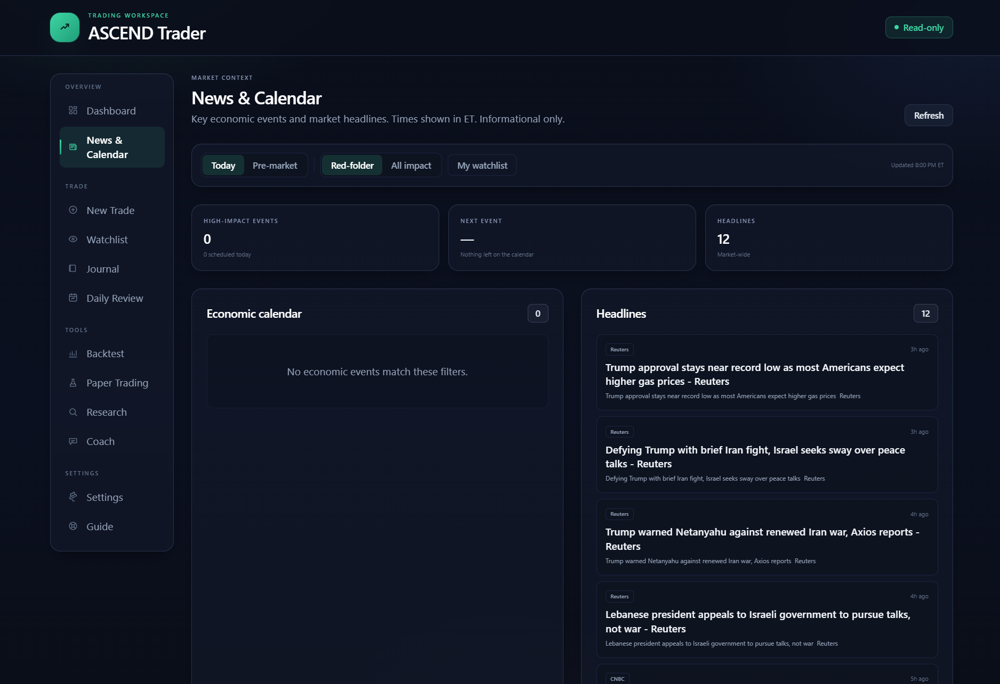
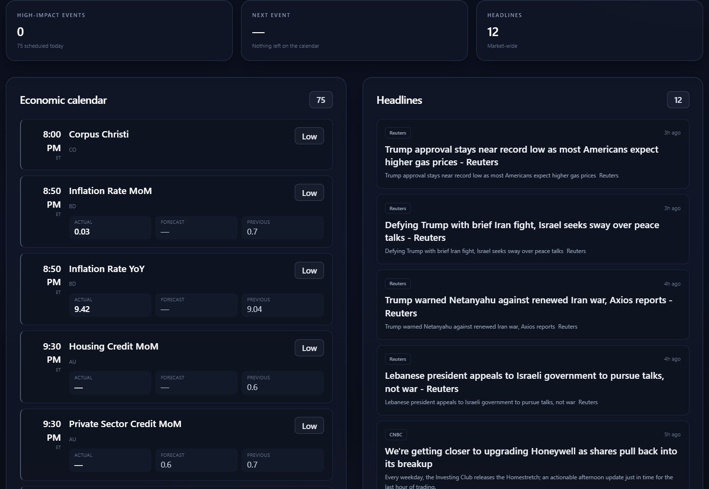
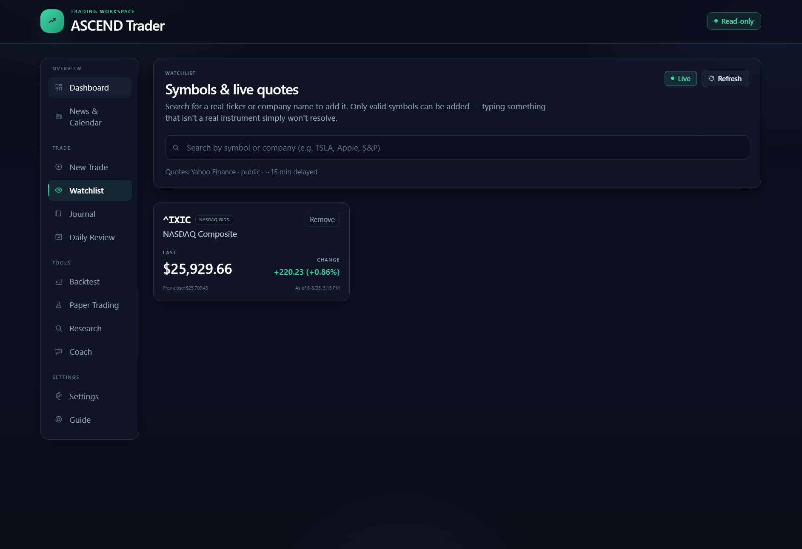
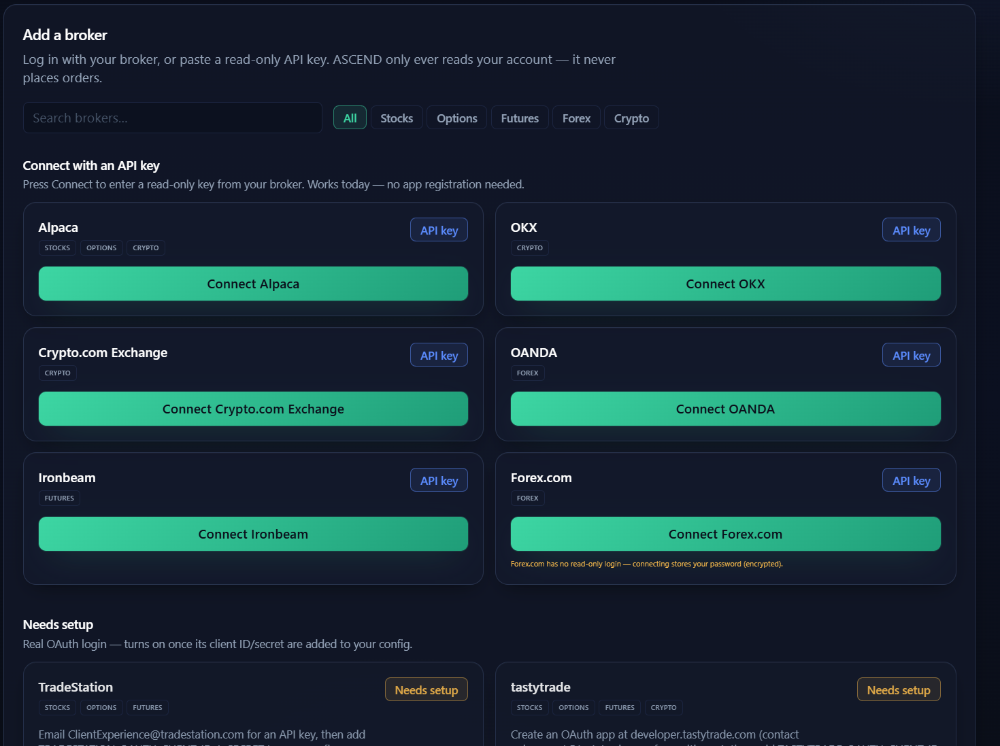

# Gallery

A visual tour of ASCEND Solutions. Architecture diagrams render inline (Mermaid) over in
**[architecture.md](architecture.md)**; this page collects **product screenshots**.

> All shots use demo/seed or delayed-market data — no real personal data, balances, or credentials.

---

## ASCEND Trader

The safety-first research workbench — research, risk, paper/simulation, journaling, news, and a
coach. It never places orders.

*Dashboard — market pulse, your edge, and the trade coach, all in one place. "Market closed · no
broker connected."*

*News & calendar — market headlines and high-impact "red-folder" economic events. Informational only.*

  
  

*Left: the economic calendar, populated with upcoming releases. Right: the watchlist — live
(≈15-min delayed) quotes; only real, resolvable symbols can be added.*

*Connect a broker — read-only. "ASCEND only ever reads your account — it never places orders."*

*The guide makes the safety model explicit: **Plan → Activate → Execute → Review** — you execute
manually, in your own broker. **"ASCEND never places your trades."***

*The trade coach (Beta) — "a reflective AI coach for your research, risk, and trading psychology. It
won't give buy/sell signals or predict prices." Footer reads: AI-generated · educational support,
not financial advice.*

| Still to add | File | Status |
| --- | --- | --- |
| Research + AI summary | `trader-research.png` | ⬜ needed |
| Risk review | `trader-risk.png` | ⬜ needed |
| Paper / backtest runner | `trader-paper.png` | ⬜ needed |

---

## ASCEND Planner — Web

The discipline product — plan a day, keep streaks honest, review the week, and ask APEX for help.

*The weekly planner — categories (Academics, Fitness, Skills, Faith, Career), all-day items, fixed
events, and the hour-by-hour grid. Keyboard-first: every nav item has a shortcut.*

*The APEX workspace — chat grounded in your real plan (note the context chips: Today's plan · This
week · Unscheduled). It reads your schedule, suggests next actions, and replies in plain language —
not raw data.*

| Still to add | File | Status |
| --- | --- | --- |
| Dashboard / follow-through | `planner-dashboard.png` | ⬜ needed |
| Habits & streaks | `planner-habits.png` | ⬜ needed |
| Stats & review | `planner-stats.png` | ⬜ needed |

---

## Hub / marketing site

| Shot | File | Status |
| --- | --- | --- |
| Landing hero | `hub-hero.png` | ⬜ needed |
| Ecosystem / products section | `hub-ecosystem.png` | ⬜ needed |
| /app launcher | `hub-launcher.png` | ⬜ needed |

## Mobile (in development)

| Shot | File | Status |
| --- | --- | --- |
| Mobile planner (preview) | `mobile-preview.png` | ⬜ needed |

---

*To add a pending shot: drop the file into [`../assets/screenshots/`](../assets/screenshots/) with
the filename above, then swap its row for an `` embed.*
