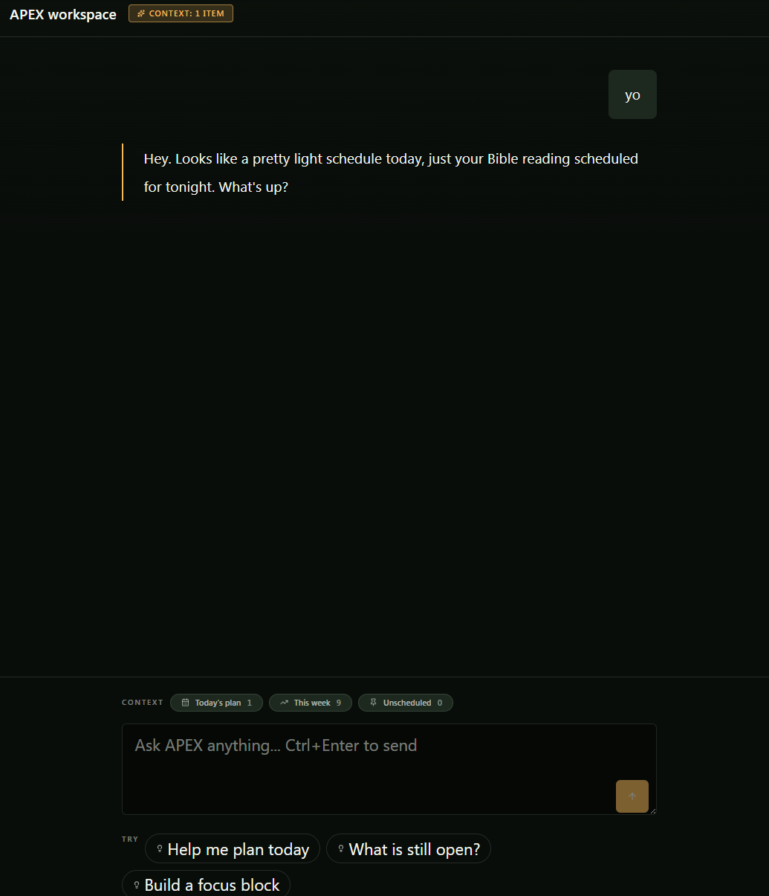
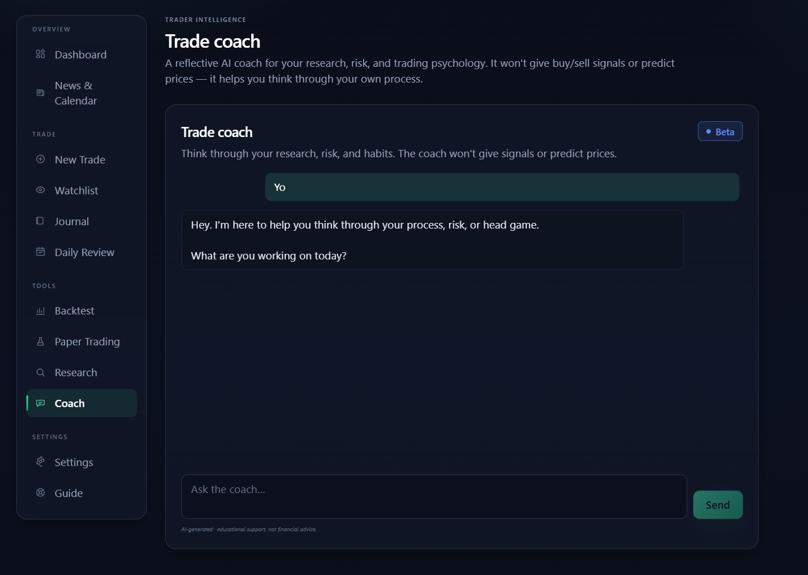
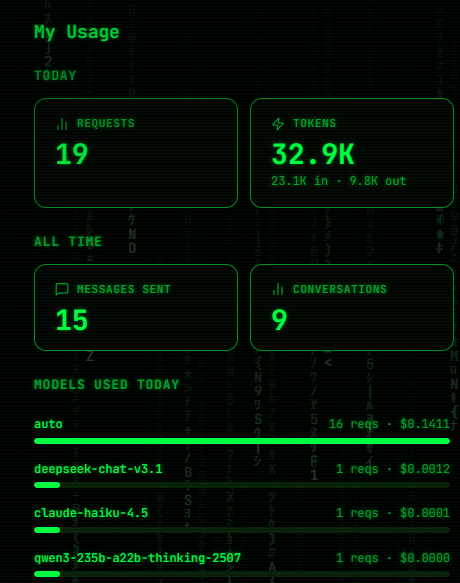

# Recent updates

Product-facing release notes for **ASCEND Solutions** — what shipped to production and what you
actually get, newest first, with screenshots. For the engineering ship log (including the bugs that
had to be beaten), see **[showcase-log.md](showcase-log.md)**; for the thematic milestone summary,
**[changelog.md](changelog.md)**.

<!--
  HOW TO ADD AN UPDATE (do this on each production push that's worth showing):
  1. Add a new "## YYYY-MM-DD — <headline>" block at the TOP (newest first).
  2. Write 2–4 plain, product-facing sentences: what shipped and what the user gets.
  3. Drop screenshots into ../assets/screenshots/ and embed: 
  4. Mirror the newest block's summary + hero images into the README "Recent updates" section
     so the repo landing page shows the latest change.
-->

---

## 2026-06-08 — APEX is live across ASCEND, and one login

**In production now:** AI is switched **on** across both products, and sign-in is unified — one
account works everywhere.

- **Planner — APEX assistant.** APEX now answers **grounded in your real schedule**: day analysis,
  weekly summaries, and a chat that suggests your next action in plain language (not raw data).
- **Trader — AI coach + analysis.** A reflective **trade coach** (no buy/sell signals, no price
  predictions), plus a research summarizer, risk review, and strategy extraction.
- **One login.** The Trader now shares the Planner's account — **sign in once**, use both.
- **Honestly run.** Everything routes behind the private AI boundary (guardrailed, audited,
  kill-switchable) through a Cloudflare Worker to the **Nyquest** multi-model gateway, with **real
  per-call cost capture.**
- **Still off by design.** Real-money trading stays disabled; order placement is blocked server-side.

  
  

<b>Left:</b> APEX, grounded in your real plan (context chips: Today's plan · This week · Unscheduled). <b>Right:</b> the Trader's reflective coach.

  

Honestly metered — real per-call cost capture, auto-routing across models (<code>deepseek</code> · <code>claude-haiku</code> · <code>qwen</code>).

*Engineering detail — the unified-identity config, the production bugs found and fixed, and the
full rollout — is in the **[ship log](showcase-log.md)**.*
